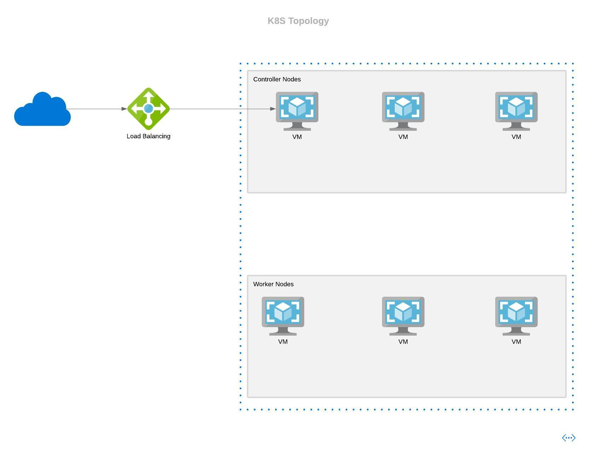

# Introduction

This is a lab exercise for kubernetes on Azure. This is highly inspired from _Learning Kubernetes The Hard Way_ by **Kelsey HighTower**.

## K8s Architecture
The node topology for this lab would be as per the following diagram:

A look at kubernetes architecture int he following diagram:

